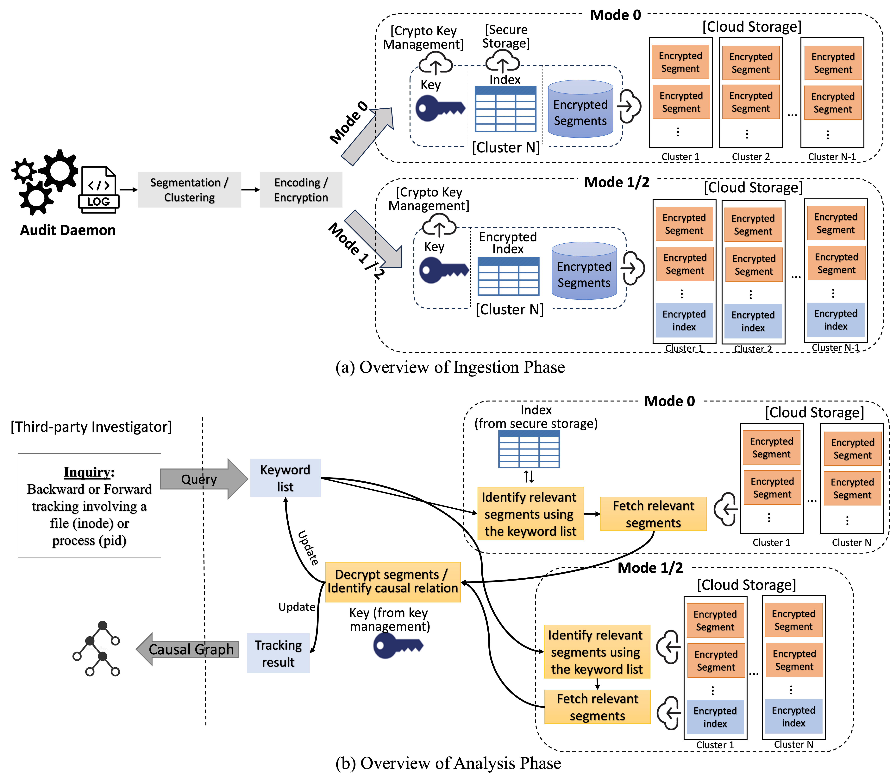
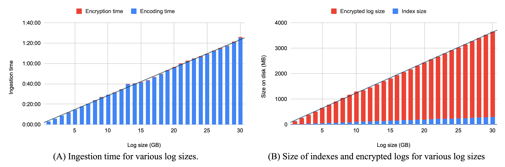

## 🚀 FA-SEAL: Forensic Analysis on Encrypted Audit Logs

FA-SEAL is a system that enables **forensic investigation directly on encrypted audit logs**, revealing only attack-relevant information.

### ⚡ Key Highlights
- Processes ~30GB/day logs in ~90 minutes (single core)
- Discloses only **0.68% of sensitive data**
- Supports forward & backward attack tracing
- Designed for **privacy-preserving, scalable security analytics**

## ❓ Why FA-SEAL?

Traditional forensic analysis requires full access to audit logs, exposing sensitive data.

FA-SEAL solves this by:
- Keeping logs encrypted
- Revealing only attack-relevant information
- Enabling secure collaboration with external investigators

## 🏗️ System Overview



FA-SEAL consists of:
- **Client**: log ingestion and encryption  
- **Server**: encrypted log storage  
- **Investigator**: query and forensic analysis  

### 🔍 Example Workflow

1. Logs are collected and encrypted on the client  
2. Encrypted logs are stored on the server  
3. Investigator issues queries (e.g., trace process execution)  
4. FA-SEAL reveals only relevant data for analysis  

## ⚙️ Quick Start

To get started, clone this repo and follow the instructions detailed in this [document](instruction.md).

```bash
git clone https://github.com/BasantaChaulagain/faseal
```

## 📊 Performance

- 30GB logs processed in ~90 minutes (single core)
- 0.68% data exposure during investigation
- Efficient forward and backward attack tracing



## 📄 Publication

FA-SEAL: Forensically Analyzable Symmetric Encryption for Audit Logs  
[ACSAC 2024](https://ieeexplore.ieee.org/document/10917745)
